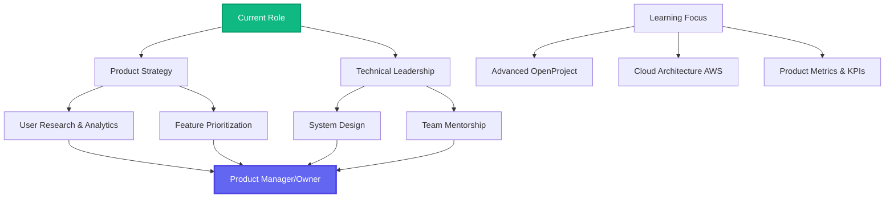

#  Hey there, I'm Abdullah Al Noman!

<div align="center">
  
</div>

<div align="center">
  <a href="https://abdullahalnomancse.netlify.app/">
    
  </a>
  <a href="mailto:abdullahalnomancse@gmail.com">
    
  </a>
  <a href="https://linkedin.com/in/abdullahalnomancse">
    
  </a>
  <a href="https://github.com/AlNomanCSE">
    
  </a>
  <a href="https://leetcode.com/AlNomanCSE">
    
  </a>
</div>

<br>

---

## 🚀 About Me

```javascript
const abdullah = {
    title: "Software Developer & Aspiring Product Manager",
    company: "Innovative Skills BD",
    location: "Dhaka, Bangladesh 🇧🇩",
    education: "B.Tech in CSE | NIT Rourkela 🎓",
    scholar: "ICCR Scholar (Govt. of India)",
    
    expertise: {
        product: ["Roadmap Planning", "Stakeholder Management", "Strategic Execution"],
        technical: ["Full-Stack Architecture", "API Design", "System Scalability"],
        management: ["OpenProject", "Agile/Scrum", "Team Leadership"]
    },
    
    currentFocus: "Bridging engineering excellence with product strategy",
    careerGoal: "Evolving into a Product Manager/Owner role 🎯"
};
```

> 💡 **Impact:** Drove 20% improvement in user retention through strategic product feature delivery at Innovative Skills BD.

---

## 💼 Professional Journey

<table>
<tr>
<td align="center" width="50%">

### 🏢 Software Developer & Product Manager
**Innovative Skills BD**  
*Dec 2025 - Present*

🎯 **Product Strategy & Execution**  
📊 Managing workflows via **OpenProject**  
⚙️ Building scalable **Laravel** & **Node.js** systems  
👥 Leading recruitment & team operations  
📚 Conducting technical training sessions

</td>
<td align="center" width="50%">

### 🎓 MERN Stack Instructor
**European IT Institute**  
*Sept 2025 - Nov 2025*

📖 Designed 36-class curriculum  
🚀 Mentored students on portfolio building  
💻 Taught JavaScript → Cloud Deployment  
✨ Focus on clean code & best practices

</td>
</tr>
<tr>
<td align="center" colspan="2">

### 💻 Frontend Developer
**OutNet (Remote/International)**  
*March 2025 - Sept 2025*

⚛️ Developed React.js components for international clients  
📉 Reduced frontend bugs by 30% via TypeScript & testing  
🔌 Specialized in state management & API integration

</td>
</tr>
</table>

---

## 🛠️ Technical Arsenal

<div align="center">

### 📋 Product & Project Management


### 💻 Languages


### ⚙️ Frameworks & Libraries


### 🗄️ Databases & Tools


</div>

---

## 🏆 Featured Projects

### 🤖 AI Healthcare Chat Ecosystem
> **Full-stack AI application** with real-time streaming and multi-model support

**Tech Stack:** Next.js 14, RTK Query, AI Integration  
**Features:** Real-time chat, Multi-model AI support, Modern UI/UX  
🔗 [Source Code](#)

---

### 🏫 NB School Management System
> **Secure role-based academic management** system

**Tech Stack:** Spring Boot, MySQL, RESTful APIs  
**Features:** Role-based access, Student/Teacher management, Secure authentication  
🔗 [Source Code](#)

---

## 📈 Growth Roadmap

<div align="center">



</div>

---

## 📊 GitHub Analytics

<div align="center">
  
  
</div>

<div align="center">
  
</div>

---

## 🎓 Education & Achievements

**🏛️ National Institute of Technology (NIT), Rourkela, India**  
*B.Tech in Computer Science & Engineering (2018-2023)* | CGPA: 7.20/10  
🏆 **ICCR Scholar** - Full international scholarship by Govt. of India

**📜 Professional Certifications:**
- Java Professional Training (Pondit) - Spring Ecosystem
- MERN Stack Specialization (Internshala) - Verified

**🌟 Leadership & Extracurriculars:**
- 💻 **LeetCode:** 50+ DSA problems solved
- 🏎️ **Black Mamba Racing:** Management operations director for Formula Student project
- 🎤 **NIT Rourkela MUN:** Delegate with advanced negotiation skills

---

## 📬 Let's Connect!

I'm passionate about **Product Strategy**, **Full-Stack Development**, and **Team Leadership**. Whether you want to discuss OpenProject workflows, EdTech innovations, or technical architecture — I'd love to hear from you!

<div align="center">

📧 **Email:** abdullahalnomancse@gmail.com  
💼 **LinkedIn:** [abdullahalnomancse](https://linkedin.com/in/abdullahalnomancse)  
🌐 **Portfolio:** [abdullahalnomancse.netlify.app](https://abdullahalnomancse.netlify.app)  
📱 **Phone:** +880 1771810475

</div>

---

<div align="center">
  
</div>

<div align="center">
  
</div>
