#  Hey there, I'm Abdullah Al Noman!

<div align="center">
  
</div>

<div align="center">
  <a href="https://abdullahalnomancse.netlify.app/">
    
  </a>
  <a href="mailto:abdullahalnomancse@gmail.com">
    
  </a>
  <a href="https://linkedin.com/in/abdullahalnomancse">
    
  </a>
  <a href="https://github.com/AlNomanCSE">
    
  </a>
</div>

<br>

<div align="center">
  
</div>

---

## 🚀 About Me

```javascript
const abdullah = {
    role: "Full-Stack Developer & MERN Stack Instructor",
    location: "Dhaka, Bangladesh 🇧🇩",
    education: "B.Tech in CSE from NIT Rourkela",
    currentlyTeaching: "MERN Stack @ European IT Institute",
    currentFocus: ["Microservices", "Cloud Architecture", "System Design"],
    funFact: "I debug with console.log and I'm not ashamed! 😄"
};
```

> 💡 **Currently:** Teaching the next generation of developers while building scalable web solutions!

---

## 💼 Professional Journey

<table>
  <tr>
    <td align="center" width="50%">
      <h3>🎓 MERN Stack Instructor</h3>
      <b>European IT Institute</b><br>
      <i>Sep 2025 - Present</i><br><br>
      📚 Designed 36-class curriculum<br>
      👥 Mentoring 50+ students<br>
      🚀 Teaching full-stack development
    </td>
    <td align="center" width="50%">
      <h3>💻 Web Developer</h3>
      <b>OutNet (Remote)</b><br>
      <i>Mar - Sep 2025</i><br><br>
      🔧 Built scalable MERN applications<br>
      🔐 Implemented secure APIs<br>
      ⚡ Optimized performance & security
    </td>
  </tr>
</table>

---

## 🛠️ Tech Arsenal

<div align="center">

### 💻 Languages


### 🎨 Frontend Development


### ⚙️ Backend Development


### 📱 Cross-Platform


### 🗄️ Databases


### 🔧 Tools & DevOps


### 🤖 AI/ML


</div>

---

## 🎯 Featured Projects

<div align="center">
  
| Project | Tech Stack | Description | Links |
|---------|------------|-------------|-------|
| **🏥 AI Healthcare Chat** | Next.js 14, TypeScript, Redux Toolkit | Real-time AI chat with multiple models, JWT auth, conversation management | [GitHub](https://github.com/AlNomanCSE/ai-healthcare-chat) |
| **📦 Product Management** | Laravel, Inertia.js, React, TypeScript | Full CRUD with real-time search, dark mode, SPA navigation | [GitHub](https://github.com/AlNomanCSE/laravel-product-management) |
| **📝 Blog Platform** | Laravel, Inertia.js, React | Authentication, CRUD operations, role-based access | [GitHub](https://github.com/AlNomanCSE/laravel-blog) |

</div>

---

## 📊 GitHub Analytics

<div align="center">
  
  
</div>

<div align="center">
  
</div>

---

## 🏆 Achievements & Certifications

<div align="center">

### 🎖️ Achievements


### 📜 Certifications
- **Java Professional** - From Basic to Professional (Pondit)
- **React.js Training** - Internshala
- **Node.js Training** - Internshala
- **MERN Stack** - Course Designer & Instructor

</div>

---

## 💻 Problem Solving Profile

<div align="center">
  <a href="https://leetcode.com/u/Abdullah_noman/">
    
  </a>
  <br><br>
  
</div>

---

## 📈 Current Focus & Learning

```mermaid
graph LR
    A[Current Focus] --> B[🚀 Microservices]
    A --> C[☁️ Cloud Architecture]
    A --> D[🏗️ System Design]
    
    E[Learning] --> F[🏛️ Software Architecture]
```

<div align="center">



</div>

---

## 🎮 When I'm Not Coding

<div align="center">

| 📺 Anime Enthusiast | 🎮 Open-World Gamer | 🍿 Tech Documentary Buff | 📚 Architecture Books |
|---------------------|---------------------|-------------------------|----------------------|

</div>

---

## 📬 Let's Connect!

<div align="center">
  
I'm always excited to collaborate on interesting projects or discuss tech! Feel free to reach out:

📧 **Email:** abdullahalnomancse@gmail.com  
💼 **LinkedIn:** [linkedin.com/in/abdullahalnomancse](https://linkedin.com/in/abdullahalnomancse)  
🌐 **Portfolio:** [abdullahalnomancse.netlify.app](https://abdullahalnomancse.netlify.app/)  

</div>

---

<div align="center">
  
</div>

<div align="center">
  <b>⭐ If you find my work interesting, don't forget to star my repositories!</b>
</div>
